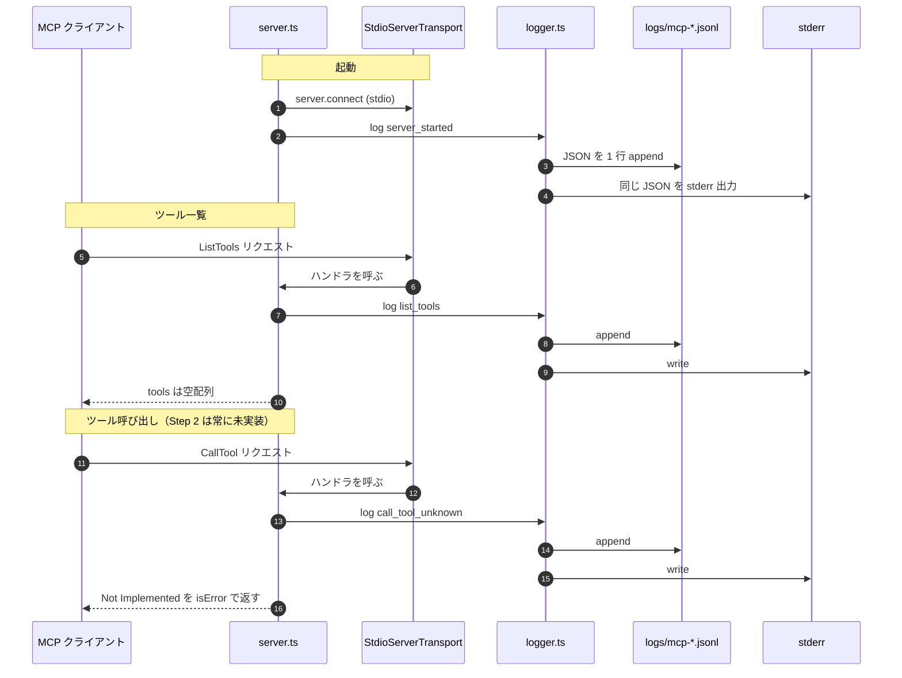

# Step 2: MCPサーバー最小起動 — stdio + 空ツール

> 上から順に読んで、コマンド・ファイル内容をそのままコピペすれば完了します。

## このStepで作るもの

### Step 2 完了時点のディレクトリ構造

```text
aiagent-handson/
├── .env
├── .env.example
├── .gitignore
├── docker-compose.yml        ← 更新（このStep、mcpにlogsボリューム追加）
├── logs/
│   └── mcp-<timestamp>.jsonl ← 新規（このStep、実行時に生成）
├── aiagent/
│   ├── Dockerfile
│   ├── package.json
│   └── tsconfig.json
└── mcp/
    ├── Dockerfile
    ├── package.json          ← 更新（SDK依存追加）
    ├── tsconfig.json
    ├── resources/
    │   └── gourmet-api.html
    └── src/                  ← 新規（このStep）
        ├── server.ts         ← 新規（このStep、stdio起動+空ツール）
        └── logger.ts         ← 新規（このStep、JSON Lines ログ基盤）
```

### 作成・更新ファイル

- `mcp/package.json` に `@modelcontextprotocol/sdk` を追加
- `mcp/src/server.ts`（MCPサーバー本体、最小構成）
  - stdio トランスポートで起動
  - `ListTools` は空配列を返す
  - `CallTool` は `Not Implemented` を返す
  - すべてのログ出力は `logger.log()` 経由
- `mcp/src/logger.ts`（ファイル+stderr 二重出力の JSON Lines ロガー）
- `docker-compose.yml` の `mcp` サービスに `./logs:/app/logs` を追加

この段階では **ツールは1つも実装しません**。MCPプロトコルの「骨組み」と**観測性基盤**を立てるのが目的です。

## シーケンス図

Step 2 で作った MCP サーバーが「呼ばれたときに実際に何が起きるか」を、
最小の登場人物だけでまとめた図。

### 登場パーツ

- **`mcp/src/server.ts`** — `Server` インスタンス + `ListTools` / `CallTool` の 2 ハンドラ
- **`mcp/src/logger.ts`** — JSON Lines ロガー。ファイル (`logs/mcp-*.jsonl`) と stderr に二重出力し、
  シークレットを自動で `[REDACTED]` に置換する
- **`StdioServerTransport`** — MCP SDK 提供の stdio 経由 JSON-RPC トランスポート

### 図



### 押さえておきたい 3 点

1. **stdout は MCP プロトコル専用**。サーバー側のログは必ず **stderr + ファイル**に書く
   （stdout に書くとプロトコルが壊れる）。`logger.ts` が `console.error` +
   `appendFileSync` の両方を呼ぶのはこのため。
2. **ツールは空でも MCP として成立する**。`ListTools` が空配列を返すのも仕様上正しい応答。
   Step 3 以降でここに `search_shops` などを足していく。
3. **業務エラーは `isError: true` で返す**（throw しない）。throw すると MCP クライアント側で
   通信エラー扱いになり、業務エラーと区別できなくなる。Step 2 の `Not Implemented` 応答は
   「ツールは届いているが中身がまだ無い」を表現している。

## 完了条件

- `docker compose build` が成功する
- `docker compose run --rm mcp npm run dev` で stderr に `[mcp] server started on stdio` が出る

## 所要時間

約 15 分

## 前提条件

- Step 1 が完了していること（`docker compose build` が既に1度は通っている状態）
- 作業ディレクトリは ``

---

## 手順

### 1. ディレクトリに移動

```bash
cd aiagent-handson/
```

### 2. `mcp/src/` ディレクトリを作成

```bash
mkdir -p mcp/src
```

### 3. `mcp/package.json` に依存を追加

Step 1 で作った `mcp/package.json` に `dependencies` セクションを追加して、次の内容に置き換えます:

```bash
cat > mcp/package.json << 'EOF'
{
  "name": "mcp",
  "version": "0.1.0",
  "private": true,
  "type": "module",
  "description": "会食ムキムキ君 グルメ MCP Server",
  "scripts": {
    "dev": "node src/server.ts"
  },
  "engines": {
    "node": ">=24"
  },
  "dependencies": {
    "@modelcontextprotocol/sdk": "^1.29.0"
  }
}
EOF
```

**ポイント**:
- `@modelcontextprotocol/sdk` は 2026-04 時点で `^1.29.0` が最新安定
- MCPサーバー実装・クライアント実装・型定義・stdio/HTTPトランスポートがすべて1パッケージに入っている

### 4. `mcp/src/logger.ts` を作成（ログ基盤）

MCPのログをファイル (`logs/mcp-<timestamp>.jsonl`) と stderr に二重出力するロガーを先に作ります。Step 2 以降すべてのログをこれに通します。

```bash
cat > mcp/src/logger.ts << 'EOF'
/**
 * MCP 側ログ出力
 *
 * - logs/mcp-<timestamp>.jsonl に1行1JSONで追記
 * - 同時に stderr にも同じJSON行を出す（開発時の即時確認用）
 * - APIキー・トークン系のフィールドは [REDACTED] に置換
 * - phase 名から日本語の短い説明を `desc` フィールドに自動付与
 */

import { appendFileSync, mkdirSync } from "node:fs";
import { dirname } from "node:path";

const LOG_DIR = process.env.LOG_DIR ?? "/app/logs";
const stamp = new Date().toISOString().replace(/[:.]/g, "-");
const LOG_FILE = `${LOG_DIR}/mcp-${stamp}.jsonl`;

// phase 名 → 日本語の短い説明。未登録 phase は desc が空文字列になる
const PHASE_DESC: Record<string, string> = {
  server_started: "MCPサーバー起動（stdio）",
  list_tools: "ツール一覧をクライアントへ応答",
  call_tool_received: "ツール呼び出しを受信",
  call_tool_done: "ツール実行が正常完了",
  call_tool_error: "ツール実行中にエラー",
  call_tool_unknown: "未知のツール名が指定された",
  gourmet_api_request: "グルメ検索API へリクエスト送信",
  gourmet_api_response: "グルメ検索API からレスポンス受信",
  fatal: "MCPサーバーで致命的エラー",
};

let initialized = false;
function ensureInit(): void {
  if (initialized) return;
  mkdirSync(dirname(LOG_FILE), { recursive: true });
  initialized = true;
}

const REDACT_KEYS = /(api[_-]?key|auth[_-]?token|password|secret)/i;

function redact(value: unknown): unknown {
  if (typeof value === "string") {
    const candidates = [
      process.env.GOURMET_API_KEY,
      process.env.MCP_AUTH_TOKEN,
      process.env.OPENAI_API_KEY,
    ].filter((v): v is string => Boolean(v && v.length > 8));
    let out = value;
    for (const secret of candidates) {
      if (out.includes(secret)) {
        out = out.split(secret).join("[REDACTED]");
      }
    }
    return out;
  }
  if (Array.isArray(value)) return value.map(redact);
  if (value && typeof value === "object") {
    const out: Record<string, unknown> = {};
    for (const [k, v] of Object.entries(value as Record<string, unknown>)) {
      out[k] = REDACT_KEYS.test(k) ? "[REDACTED]" : redact(v);
    }
    return out;
  }
  return value;
}

export function log(phase: string, data: Record<string, unknown> = {}): void {
  ensureInit();
  const entry = {
    ts: new Date().toISOString(),
    source: "mcp",
    phase,
    desc: PHASE_DESC[phase] ?? "",
    ...(redact(data) as Record<string, unknown>),
  };
  const line = JSON.stringify(entry);
  appendFileSync(LOG_FILE, line + "\n");
  console.error(line);
}
EOF
```

**ポイント**:
- `LOG_DIR` は環境変数で差し替え可。コンテナ内では `/app/logs`（docker-compose で `./logs` にマウント）
- プロセス起動時に1つの `mcp-<timestamp>.jsonl` を確定。同一実行内ではこのファイルに追記
- `[REDACTED]` は **2 層で守る**: (1) キー名マッチ（`api_key` など）、(2) 値文字列マッチ（`.env` の実値が混入していたら潰す）
- **`PHASE_DESC` で phase 名を日本語説明に変換して `desc` 自動付与**。呼び出し側はこれまで通り `log("phase名", {...})` だけでOK
- `console.error` 併用で、Terminal A 側でも流れが見える

### 5. `mcp/src/server.ts` を作成

```bash
cat > mcp/src/server.ts << 'EOF'
import { Server } from "@modelcontextprotocol/sdk/server/index.js";
import { StdioServerTransport } from "@modelcontextprotocol/sdk/server/stdio.js";
import {
  CallToolRequestSchema,
  ListToolsRequestSchema,
} from "@modelcontextprotocol/sdk/types.js";
import { log } from "./logger.ts";

async function main() {
  const server = new Server(
    { name: "kaishoku-mukimuki-mcp", version: "0.1.0" },
    { capabilities: { tools: {} } }
  );

  // Step 2: ツールは空。Step 3 以降で search_shops / get_shop_detail を追加
  server.setRequestHandler(ListToolsRequestSchema, async () => {
    log("list_tools", { count: 0 });
    return { tools: [] };
  });

  // Step 2: CallTool は常に Not Implemented を返す
  server.setRequestHandler(CallToolRequestSchema, async (request) => {
    log("call_tool_unknown", { name: request.params.name });
    return {
      content: [
        { type: "text", text: `Not Implemented: ${request.params.name}` },
      ],
      isError: true,
    };
  });

  await server.connect(new StdioServerTransport());
  log("server_started", { transport: "stdio" });
}

main().catch((err) => {
  log("fatal", { message: err instanceof Error ? err.message : String(err) });
  process.exit(1);
});
EOF
```

**ポイント**:
- `Server` コンストラクタ第2引数の `capabilities.tools` はサーバーが tools 機能を提供することの宣言
- `setRequestHandler(ListToolsRequestSchema, ...)` は**Zodスキーマから型推論**される型付きハンドラ
- `StdioServerTransport` は `process.stdin` / `process.stdout` を直接使う
- **ログはすべて `log()` 経由**（stdout は MCP プロトコルが占有するため、必ず stderr + ファイルに書く）
- `CallTool` の戻りで `isError: true` + `content[].type: "text"` は **MCP仕様の業務エラー形式**

### 6. `docker-compose.yml` の `mcp` サービスに `logs` ボリュームを追加

現状は `agent` だけに `./logs:/app/logs` が設定されています。`mcp` 側にも追加して、ホストの `logs/` に MCPログが書き出されるようにします。

```bash
cat > docker-compose.yml << 'EOF'
services:
  mcp:
    build:
      context: ./mcp
    working_dir: /app
    volumes:
      - ./mcp:/app
      - /app/node_modules
      - ./logs:/app/logs
    env_file:
      - .env

  agent:
    build:
      context: ./aiagent
    working_dir: /app
    volumes:
      - ./aiagent:/app
      - /app/node_modules
      - ./logs:/app/logs
    env_file:
      - .env
    depends_on:
      - mcp
EOF
```

**ポイント**:
- `./logs:/app/logs` でホストの `logs/` とコンテナ内 `/app/logs` が繋がる
- コンテナが書いた `mcp-<timestamp>.jsonl` がそのままホスト側で `tail -f` できる
- `docker compose logs -f` は `run --rm` の一時コンテナを確実に追えないため、**ファイルベース観察**の方が信頼できる

### 7. Dockerイメージを再ビルド

`package.json` に依存が増えたので、コンテナ内 `node_modules` を作り直します。

```bash
docker compose build mcp
```

期待する終盤:

```
#8 [4/4] RUN npm install --omit=dev 2>/dev/null || true
#8 4.093 added 91 packages, and audited 92 packages in 4s
#8 DONE 4.2s
```

**91 packages** は MCP SDK + 推移的依存の合計で、この数前後が正常値。

---

## 動作確認

MCPサーバーは stdio で起動すると stdin 入力を待ち続けます。ここでは起動メッセージだけ確認します。

### 方法A: `timeout` で2秒後に自動停止（おすすめ）

```bash
docker compose run --rm mcp timeout 2 npm run dev
```

期待する出力:

```
> mcp@0.1.0 dev
> node src/server.ts

[mcp] server started on stdio
```

最後の行 `[mcp] server started on stdio` が出れば **Step 2 完了** です。

### 方法B: 手動で起動して Ctrl+C

```bash
docker compose run --rm mcp npm run dev
# → {"ts":"...","source":"mcp","phase":"server_started",...} が出たら Ctrl+C で停止
```

stderr には JSON 1行が出て、同時に `logs/mcp-<timestamp>.jsonl` にも同じ内容が追記されます。

---

## ログ観察タブ（Terminal B）

このStepから **2ターミナル運用** が始まります。

### このStepで見えるログ phase

- `server_started` — MCP が stdio で起動した瞬間
- `list_tools` — `ListTools` リクエストを受け取った瞬間（ツールは空）
- `call_tool_unknown` — `CallTool` に不明なツール名が来た瞬間（`Not Implemented` 応答）
- `fatal` — 起動時に例外が出た瞬間

### Terminal B で実行するコマンド

**生JSON版（どの環境でも動く）**:

```bash
# 別タブで実行しておく
cd aiagent-handson/
tail -f logs/mcp-*.jsonl
```

**jq 版（読みやすい、要 `brew install jq`）**:

```bash
tail -f logs/mcp-*.jsonl | jq -r '"\(.ts) [\(.source):\(.phase)] \(. | del(.ts, .source, .phase) | tostring)"'
```

### 期待される出力（Terminal B 側）

Terminal A で `docker compose run --rm mcp timeout 2 npm run dev` を叩くと、Terminal B に以下のような行が流れます:

```json
{"ts":"2026-04-24T18:26:59.316Z","source":"mcp","phase":"server_started","desc":"MCPサーバー起動（stdio）","transport":"stdio"}
```

**`desc` フィールド**で「何が起きたか」が日本語で一目瞭然。後続のStepで phase が増えてもこの読みやすさが維持されます。

これが見えれば **2ターミナル観察の導入に成功** です。
Step 3 以降で `list_tools` / `call_tool_received` / `gourmet_api_request` などが続々と追加されていきます。

---

## トラブルシュート

| 症状 | 原因候補 | 対処 |
|---|---|---|
| `Cannot find module "@modelcontextprotocol/sdk/server/index.js"` | `docker compose build` を忘れた | `docker compose build mcp` を再実行 |
| `ERR_MODULE_NOT_FOUND` で `.js` 拡張子関連 | `import` パスが `.js` 付きになっていない | SDK は Node の ESM 解決に従うため `.js` 付きで書く必要あり。上のコードのまま貼れば問題ない |
| 起動メッセージが出ず即終了する | `server.connect` より前で例外 | `docker compose run --rm mcp npm run dev 2>&1` でエラー確認 |
| `error Missing script: "dev"` | package.json の scripts が壊れた | 手順3を再確認して `cat` コマンドをやり直す |

---

## このStepでの勘どころ

1. **MCP は素朴に stdio で動く**
   - プロトコルはJSON-RPC over stdio
   - 難しい設定や認証は不要。最小単位はこのくらい短い
   - stdout を占有するので**ログは必ず stderr**

2. **tools は後から足せる**
   - `ListTools` に空配列を返してもMCPとしては完全に正しい
   - MCPクライアントは「このサーバーにはツールがない」と認識するだけ
   - まず骨組みを立ててから機能を足す、という順序が学習にも実務にも効く

3. **`isError: true` は業務エラー、例外は通信エラー**
   - ツールが「実行できたけど業務的に失敗」を表すのが `isError: true`
   - throw するとMCPクライアント側で通信エラーになり、挙動が変わる
   - `Not Implemented` を `isError: true` で返すのは「まだ実装されていない」を業務エラーとして扱う意図

4. **`docker compose run` は起動確認用、`up` は常駐用**
   - stdio の場合 `docker compose up mcp` で起動させても入出力接続先がなく意味が薄い
   - Step 6 で Agent が MCP を spawn する形にすると、stdio が自然に繋がる

5. **`package.json` の `type: module` + Node 24 の直接実行**
   - ビルド（`tsc`）を経由せずに `.ts` がそのまま動く
   - `import ... from "@xxx/yyy/server/index.js"` の `.js` は Node ESM の慣例（実体は `.d.ts` + `.js`）

6. **観測性は Day 1 から入れる**
   - `logger.ts` を Step 2 の骨組みと同時に置く
   - 「Step 5 でログ追加」ではなく「Step 2 で仕込み、Step が進むほど phase が増える」構造
   - 後から足すと **機能ごとに console.error が散らばる** コードになりがち

---

## コミット

### 実装コミット（feat）

```bash
git add docker-compose.yml \
        mcp/package.json \
        mcp/src/logger.ts \
        mcp/src/server.ts

git commit -m "feat: Step2 MCPサーバー最小起動（stdio + 空ツール）+ ログ基盤"
```

### 手順書コミット（docs）

```bash
git add procedure-docs/step-02-mcp-minimal.md \
        dev-plan-v2.md

git commit -m "docs: Step2 手順書追加"
```

---

## やってみる ✨

### 今できるようになったこと

- **MCP サーバーが stdio で起動する**（ツールはまだ空だが骨組みはある）
- 起動ログが **`logs/mcp-*.jsonl` にファイル出力**される
- Terminal A / Terminal B の **2ターミナル運用**が成立する

### 1分でできる確認

**Terminal B**（別タブで先に開く）:

```bash
cd aiagent-handson/
tail -F logs/mcp-*.jsonl 2>/dev/null
```

**Terminal A**:

```bash
docker compose run --rm mcp timeout 2 npm run dev
```

Terminal B に `{"phase":"server_started","transport":"stdio"}` が流れれば成功。
「**MCP の骨組みが呼吸している**」のが Terminal B 側で初めて可視化される瞬間です。

---

## 次のStep

→ [Step 3: グルメラッパ + search_shops](./step-03-search-shop.md)
