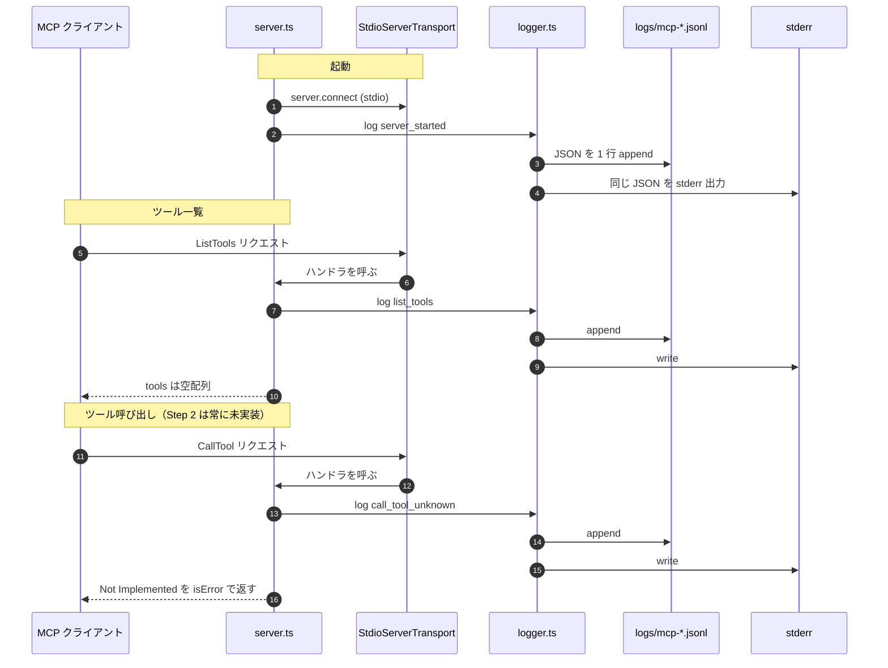

# Step 2: MCP 最小起動のシーケンス

Step 2 で作った MCP サーバーが「呼ばれたときに実際に何が起きるか」を、
最小の登場人物だけでまとめた図。細部は本体手順書 [`step-02-mcp-minimal.md`](./step-02-mcp-minimal.md) を参照。

## 登場パーツ

- **`mcp/src/server.ts`** — `Server` インスタンス + `ListTools` / `CallTool` の 2 ハンドラ
- **`mcp/src/logger.ts`** — JSON Lines ロガー。ファイル (`logs/mcp-*.jsonl`) と stderr に二重出力し、
  シークレットを自動で `[REDACTED]` に置換する
- **`StdioServerTransport`** — MCP SDK 提供の stdio 経由 JSON-RPC トランスポート

## シーケンス図

## 押さえておきたい 3 点

1. **stdout は MCP プロトコル専用**。サーバー側のログは必ず **stderr + ファイル**に書く
   （stdout に書くとプロトコルが壊れる）。`logger.ts` が `console.error` +
   `appendFileSync` の両方を呼ぶのはこのため。
2. **ツールは空でも MCP として成立する**。`ListTools` が空配列を返すのも仕様上正しい応答。
   Step 3 以降でここに `search_shops` などを足していく。
3. **業務エラーは `isError: true` で返す**（throw しない）。throw すると MCP クライアント側で
   通信エラー扱いになり、業務エラーと区別できなくなる。Step 2 の `Not Implemented` 応答は
   「ツールは届いているが中身がまだ無い」を表現している。
