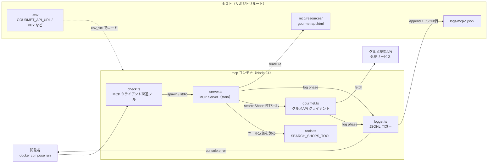

# Step 3 時点の構成図

Step 3 完了時点で動いているコンポーネントと、互いの呼び出し関係を俯瞰する図。
Agent 側 (`aiagent/`) はまだ骨組みのみで、主要な処理は MCP サーバー側に集約されている。

## 構成図



## 呼び出し関係の要点

1. **`check.ts` は MCP クライアントとして `server.ts` を同一コンテナ内で spawn する**。
   `docker compose run --rm mcp npm run check` の 1 プロセス内で stdio 経由の JSON-RPC が走る。
   外部ネットワーク呼び出しではなく、親子プロセス間の標準入出力。
2. **`server.ts` が一枚ハブ**になり、
   - ツールのメタデータは `tools.ts`（定義だけ）
   - 実行（外部 API 叩き）は `gourmet.ts`
   - ログは `logger.ts` に統一
   - MCP Resource (`gourmet-api.html`) は `readFile` で都度読む
3. **観測性は必ず `logger.ts` 経由**。`server.ts`・`gourmet.ts` の主要ポイントで
   `log("phase", {...})` を呼び、ファイル (`logs/mcp-*.jsonl`) と stderr に同時出力。
   シークレットは自動で `[REDACTED]` に置換される。
4. **`aiagent/` はまだ骨組みのみ**。Dockerfile・package.json・tsconfig.json だけ入っており、
   LLM 呼び出しや MCP 連携は Step 5〜6 で追加される。

## ディレクトリ（Step 3 完了時点）

```text
aiagent-handson/
├── docker-compose.yml       mcp / agent の 2 サービス
├── .env                     APIキー・認証トークン（gitignore）
├── logs/                    mcp-*.jsonl が溜まる（gitignore）
├── mcp/
│   ├── Dockerfile
│   ├── package.json         @modelcontextprotocol/sdk
│   ├── tsconfig.json
│   ├── resources/
│   │   └── gourmet-api.html  MCP Resource として公開（gitignore）
│   └── src/
│       ├── server.ts
│       ├── logger.ts
│       ├── tools.ts
│       ├── gourmet.ts
│       └── check.ts
└── aiagent/
    ├── Dockerfile           （Step 1 の骨組みのまま）
    ├── package.json
    └── tsconfig.json
```
