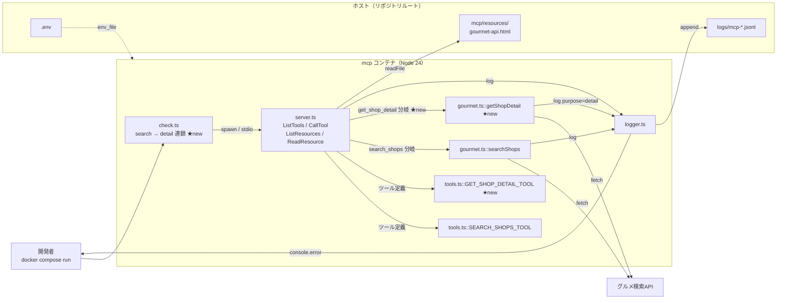

# Step 4 時点の構成図

Step 4 完了時点での構成。Step 3 からの **追加分は ★new** で示す。
骨格 (`check.ts` → `server.ts` → `gourmet.ts` → グルメ検索API、`logger.ts` 経由の観測性）
は Step 3 と同じで、**ツールと呼び出し分岐が 1 つ増えた** だけ。

## 構成図

## Step 3 からの差分

| 追加/変更点 | ファイル | 役割 |
|---|---|---|
| `GET_SHOP_DETAIL_TOOL` | `mcp/src/tools.ts` | 店舗 ID を必須入力にした 2 つめのツール定義 |
| `getShopDetail(id)` | `mcp/src/gourmet.ts` | グルメ検索API を `id` 指定で叩き単一店舗を取る |
| `get_shop_detail` 分岐 | `mcp/src/server.ts` | CallTool ハンドラに 2 つめの分岐を追加（Shop not found は `isError: true`） |
| `list_tools` の count | `mcp/src/server.ts` | 1 → 2 に更新 |
| search → detail の連鎖 | `mcp/src/check.ts` | search 結果の先頭 `shop.id` を拾って detail を呼ぶ |

## 押さえておきたい 2 点

1. **ツール追加はパターン化できる**。
   新しいツールを増やすときは「`gourmet.ts` に関数 → `tools.ts` に定義 → `server.ts` に分岐」
   の 3 点だけ触る。他のレイヤ（check.ts, logger.ts, resources, docker-compose）はそのまま。
2. **`purpose` ログタグで同じ `gourmet_api_request` phase を区別する**。
   search と detail は同じ phase 名で記録されるが、`getShopDetail` 側は
   `purpose: "detail"` を付けておくので、後の監視や集計で種別を分けられる。
