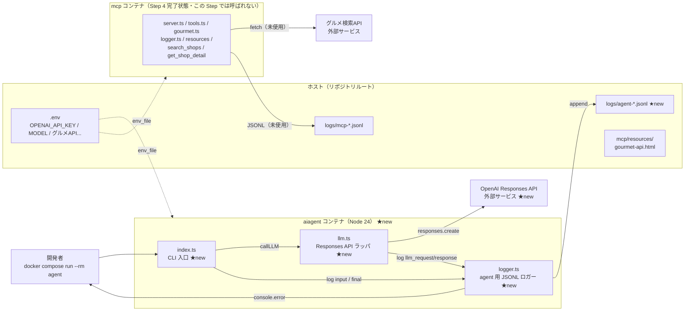

# Step 5: Agent最小（OpenAI Responses API疎通）

> 上から順に読んで、コマンド・ファイル内容をそのままコピペすれば完了します。
> **受講者が初めて Agent に話しかけるステップ**。ただし MCP 未接続なので、LLM の知識だけで応答します（ハルシネーションあり）。

## このStepで作るもの

### Step 5 完了時点のディレクトリ構造

```text
aiagent-handson/
├── .env
├── .env.example
├── .gitignore
├── docker-compose.yml
├── logs/
│   ├── mcp-<timestamp>.jsonl
│   └── agent-<timestamp>.jsonl   ← 新規（このStepから出力開始）
├── aiagent/
│   ├── Dockerfile
│   ├── package.json              ← 更新（openai / zod 追加）
│   ├── tsconfig.json
│   └── src/                      ← 新規（このStep）
│       ├── index.ts              ← 新規（このStep、CLI入口）
│       ├── llm.ts                ← 新規（このStep、OpenAI Responses APIラッパ）
│       └── logger.ts             ← 新規（このStep、JSON Linesロガー）
└── mcp/
    ├── ... (Step 4 完了状態)
```

### 作成・更新ファイル

- `aiagent/src/logger.ts` — MCP側と同パターンのJSON Linesロガー（`agent-*.jsonl` に出力）
- `aiagent/src/llm.ts` — OpenAI Responses API ラッパ
- `aiagent/src/index.ts` — CLI 入口
- `aiagent/package.json` — `openai ^6.34.0` と `zod ^4.3.6` を追加

この段階では **MCP ツールとは接続しません**。LLM との単純な1往復のみ。

## 構成図

Step 5 は **aiagent コンテナが初めて動き出す** ステップ。
ただしまだ MCP とは接続されておらず、Agent は OpenAI Responses API だけと話す。
追加・新規分は ★new で示す。



### Step 4 からの差分

| 追加/変更点 | ファイル | 役割 |
|---|---|---|
| Agent コンテナが初起動 | `docker-compose.yml`（既存） | Step 1 から定義されていた agent サービスがこの Step で初めて使われる |
| CLI 入口 | `aiagent/src/index.ts` ★new | `argv` からプロンプトを受け取り、`callLLM` を呼んで stdout へ |
| Responses API ラッパ | `aiagent/src/llm.ts` ★new | `openai` v6 の `responses.create` を薄くラップ、`content_preview` で抜粋ログ |
| Agent 用ロガー | `aiagent/src/logger.ts` ★new | `source: "agent"` 固定、`logs/agent-*.jsonl` に出力、REDACT は MCP 側と同じ |
| 依存追加 | `aiagent/package.json` | `openai ^6.34.0`・`zod ^4.3.6` |

### 押さえておきたい 3 点

1. **この Step では Agent と MCP は繋がっていない**。
   Agent は OpenAI とだけ話すので、店舗名などを聞くと **ハルシネーション** を起こす可能性がある
   （LLM の訓練知識だけで回答するため）。根拠ある回答になるのは Step 6 から。
2. **`docker compose run --rm agent` 時に MCP コンテナも起動する**
   （`depends_on: mcp` のため）が、Agent は MCP を呼ばないので **mcp-\*.jsonl は増えない**。
   Terminal B で `logs/*.jsonl` を tail すると agent 側 4 phase だけが流れる。
3. **`logger.ts` は MCP 側と意図的に同形**。`source` タグとファイル名だけ変えてあるので、
   両コンテナのログを 1 つの `tail -F logs/*.jsonl` で混ぜて眺めても
   どちらの発生源かが `source` フィールドで判別できる。

## 完了条件

- `docker compose run --rm agent npm run dev -- "<プロンプト>"` で LLM の応答が標準出力に返る
- `logs/agent-*.jsonl` に `input` → `llm_request` → `llm_response` → `final` の4 phase が記録される

## 所要時間

約 20 分

## 前提条件

- Step 4 完了済み（MCP サーバーが `search_shops` / `get_shop_detail` を提供できる）
- `.env` に `OPENAI_API_KEY` と `OPENAI_MODEL` が設定済み
- Docker Desktop が起動中

---

## 手順

### 1. ディレクトリに移動

```bash
cd aiagent-handson/
```

### 2. `aiagent/src/` ディレクトリを作成

```bash
mkdir -p aiagent/src
```

### 3. `aiagent/src/logger.ts` を作成

MCP 側と同じ役割。ファイル名だけ `agent-<timestamp>.jsonl` に変える。

```bash
cat > aiagent/src/logger.ts << 'EOF'
/**
 * Agent 側ログ出力
 *
 * - logs/agent-<timestamp>.jsonl に1行1JSONで追記
 * - 同時に stderr にも同じJSON行を出す（開発時の即時確認用）
 * - APIキー・トークン系のフィールドは [REDACTED] に置換
 * - phase 名から日本語の短い説明を `desc` フィールドに自動付与
 */

import { appendFileSync, mkdirSync } from "node:fs";
import { dirname } from "node:path";

const LOG_DIR = process.env.LOG_DIR ?? "/app/logs";
const stamp = new Date().toISOString().replace(/[:.]/g, "-");
const LOG_FILE = `${LOG_DIR}/agent-${stamp}.jsonl`;

// phase 名 → 日本語の短い説明。未登録 phase は desc が空文字列になる
const PHASE_DESC: Record<string, string> = {
  input: "ユーザー入力を受付",
  mcp_connected: "MCPサーバーに接続完了",
  agent_start: "Agent起動・ツール取得完了",
  llm_request: "OpenAIへ推論リクエスト送信",
  llm_response: "OpenAIから応答を受信",
  tool_call: "LLMがツール呼び出しを決定",
  tool_result: "MCPからツール実行結果を受信",
  filter_applied: "健康キーワードでフィルタ適用",
  filter_skipped: "フィルタをスキップ",
  agent_done: "Agentループ完了（最終応答確定）",
  final: "最終応答を標準出力に書き出し",
  error: "Agent処理中にエラー発生",
};

let initialized = false;
function ensureInit(): void {
  if (initialized) return;
  mkdirSync(dirname(LOG_FILE), { recursive: true });
  initialized = true;
}

const REDACT_KEYS = /(api[_-]?key|auth[_-]?token|password|secret)/i;

function redact(value: unknown): unknown {
  if (typeof value === "string") {
    const candidates = [
      process.env.GOURMET_API_KEY,
      process.env.MCP_AUTH_TOKEN,
      process.env.OPENAI_API_KEY,
    ].filter((v): v is string => Boolean(v && v.length > 8));
    let out = value;
    for (const secret of candidates) {
      if (out.includes(secret)) {
        out = out.split(secret).join("[REDACTED]");
      }
    }
    return out;
  }
  if (Array.isArray(value)) return value.map(redact);
  if (value && typeof value === "object") {
    const out: Record<string, unknown> = {};
    for (const [k, v] of Object.entries(value as Record<string, unknown>)) {
      out[k] = REDACT_KEYS.test(k) ? "[REDACTED]" : redact(v);
    }
    return out;
  }
  return value;
}

export function log(phase: string, data: Record<string, unknown> = {}): void {
  ensureInit();
  const entry = {
    ts: new Date().toISOString(),
    source: "agent",
    phase,
    desc: PHASE_DESC[phase] ?? "",
    ...(redact(data) as Record<string, unknown>),
  };
  const line = JSON.stringify(entry);
  appendFileSync(LOG_FILE, line + "\n");
  console.error(line);
}
EOF
```

**ポイント**:
- `source: "agent"` を固定して、MCP 側ログ（`source: "mcp"`）と区別できる
- ファイル名 `agent-<timestamp>.jsonl` で MCP ログとは **別ファイル**に書く
- Terminal B で `tail -F logs/*.jsonl` すると両方混ざって見える
- REDACT ロジックは MCP 側と完全に同じ（運用の一貫性）

### 4. `aiagent/src/llm.ts` を作成

```bash
cat > aiagent/src/llm.ts << 'EOF'
/**
 * OpenAI Responses API ラッパ
 *
 * Step 5 時点ではツール無しで「プロンプト -> テキスト応答」の単純な往復のみ。
 * Step 6 でツール定義とループを追加する。
 */

import OpenAI from "openai";
import { log } from "./logger.ts";

let _client: OpenAI | null = null;
function getClient(): OpenAI {
  if (_client) return _client;
  const apiKey = process.env.OPENAI_API_KEY;
  if (!apiKey) {
    throw new Error("OPENAI_API_KEY is not set");
  }
  _client = new OpenAI({ apiKey });
  return _client;
}

/**
 * LLM に自然言語プロンプトを投げてテキスト応答を得る。
 */
export async function callLLM(input: string): Promise<string> {
  const model = process.env.OPENAI_MODEL ?? "gpt-4.1-mini";
  const client = getClient();

  log("llm_request", { model, input_length: input.length });

  const response = await client.responses.create({
    model,
    input,
  });

  const text = response.output_text ?? "";
  log("llm_response", {
    content_length: text.length,
    content_preview: text.slice(0, 200),
  });

  return text;
}
EOF
```

**ポイント**:
- **Responses API** (`client.responses.create`) は Chat Completions API (`client.chat.completions.create`) と**別物**
  - Responses: `input` を渡して `output_text` を受ける（シンプル）
  - Chat Completions: `messages[]` を渡して `choices[].message.content` を受ける
  - openai SDK v6 以降は Responses が主流
- `output_text` は便利プロパティ。複数出力アイテムがある場合は `response.output[]` を見る
- クライアントは遅延初期化（起動時に env チェックを走らせない）
- `content_preview: text.slice(0, 200)` で長文レスポンスもログを短く保つ

### 5. `aiagent/src/index.ts` を作成

```bash
cat > aiagent/src/index.ts << 'EOF'
/**
 * Agent CLI 入口
 *
 * 使い方:
 *   docker compose run --rm agent npm run dev -- "<プロンプト>"
 *
 * Step 5: LLM との1往復のみ。ツール呼び出しは Step 6 で追加。
 */

import { callLLM } from "./llm.ts";
import { log } from "./logger.ts";

async function main() {
  const userInput = process.argv.slice(2).join(" ").trim();
  if (!userInput) {
    console.error('Usage: npm run dev -- "<prompt>"');
    process.exit(1);
  }

  log("input", { prompt: userInput });

  try {
    const answer = await callLLM(userInput);
    console.log(answer);
    log("final", { content_length: answer.length });
  } catch (err) {
    const message = err instanceof Error ? err.message : String(err);
    log("error", { phase: "main", message });
    console.error("[agent] error:", message);
    process.exit(1);
  }
}

main();
EOF
```

**ポイント**:
- `process.argv.slice(2).join(" ")` で argv を1文字列にまとめる。`npm run dev -- "沖縄で 鶏料理"` のように空白を含むプロンプトも受け取れる
- 入力 / 応答 / 終了 / エラー を必ず `log()` で記録。Terminal B に全動作が見える
- 例外は catch して `log("error", ...)` してから exit(1)。スタックトレースをそのまま出さない

### 6. `aiagent/package.json` を更新

```bash
cat > aiagent/package.json << 'EOF'
{
  "name": "aiagent",
  "version": "0.1.0",
  "private": true,
  "type": "module",
  "description": "会食ムキムキ君 AI Agent",
  "scripts": {
    "dev": "node src/index.ts"
  },
  "engines": {
    "node": ">=24"
  },
  "dependencies": {
    "openai": "^6.34.0",
    "zod": "^4.3.6"
  }
}
EOF
```

**ポイント**:
- `openai ^6.34.0` — Responses API 対応の v6 系
- `zod ^4.3.6` — `openai` の peerDependency（`^3.25 || ^4.0`）。v4 を採用

### 7. Docker イメージを再ビルド

```bash
docker compose build agent
```

期待する終盤:

```
#8 [4/4] RUN npm install --omit=dev 2>/dev/null || true
#8 1.773 added XX packages, and audited YY packages in 2s
#8 DONE 1.8s
```

---

## 動作確認

```bash
docker compose run --rm agent npm run dev -- "こんにちは。あなたは誰ですか？"
```

期待する出力（LLM の応答は毎回変わります）:

```
> aiagent@0.1.0 dev
> node src/index.ts こんにちは。あなたは誰ですか？

{"ts":"...","source":"agent","phase":"input","desc":"ユーザー入力を受付","prompt":"こんにちは。あなたは誰ですか？"}
{"ts":"...","source":"agent","phase":"llm_request","desc":"OpenAIへ推論リクエスト送信","model":"gpt-4.1-mini","input_length":15}
{"ts":"...","source":"agent","phase":"llm_response","desc":"OpenAIから応答を受信","content_length":115,"content_preview":"こんにちは！私は..."}
こんにちは！私はChatGPT、OpenAIが開発したAIの言語モデルです。...
{"ts":"...","source":"agent","phase":"final","desc":"最終応答を標準出力に書き出し","content_length":115}
```

標準出力に **LLM の自然文応答**が出て、stderr に4 phase のJSONログが出れば **Step 5 完了** です。

`logs/agent-<timestamp>.jsonl` も自動生成されます。

---

## ログ観察タブ（Terminal B）

### このStepで増えるログ phase（Agent 側）

| phase | 出るタイミング | 何が分かる |
|---|---|---|
| `input` | CLI 引数を受け取った瞬間 | ユーザー入力そのもの |
| `llm_request` | Responses API に送る直前 | 使用モデル名と入力長 |
| `llm_response` | Responses API からレスポンス受信直後 | 応答の長さと先頭200文字 |
| `final` | 標準出力に answer を出した直後 | 応答の全体長 |
| `error` | いずれかで例外 | エラーメッセージ |

### Terminal B で実行するコマンド

別タブで:

```bash
cd aiagent-handson/
# Agent ログのみ
tail -F logs/agent-*.jsonl 2>/dev/null
# MCP + Agent 両方
tail -F logs/*.jsonl 2>/dev/null
# jq 整形版
tail -F logs/*.jsonl 2>/dev/null | jq -r '"\(.ts) [\(.source):\(.phase)] \(. | del(.ts, .source, .phase) | tostring)"'
```

Step 5 段階では **Agent 側の4 phase だけ**が流れます。MCP は呼ばれないので mcp-*.jsonl は更新されません。Step 6 で両方が混ざり始めます。

---

## トラブルシュート

| 症状 | 原因候補 | 対処 |
|---|---|---|
| `OPENAI_API_KEY is not set` | `.env` に未設定 or env_file 読み込みミス | `.env` を確認、`docker-compose.yml` の `env_file: .env` を確認 |
| `401 Incorrect API key` | キー誤り | OpenAI ダッシュボードで正しいキーを再取得 |
| `404 model_not_found` | モデル名誤り | `.env` の `OPENAI_MODEL` を `gpt-4.1-mini` 等に修正 |
| `Cannot find module 'openai'` | `docker compose build agent` 忘れ | ビルド再実行 |
| `Usage: npm run dev -- "<prompt>"` | 引数なしで起動 | プロンプトを付ける |

---

## このStepでの勘どころ

1. **Responses API と Chat Completions API は別物**
   - `client.responses.create` と `client.chat.completions.create` は形が違う
   - Responses: `input` -> `output_text`（シンプル）
   - Chat Completions: `messages[]` -> `choices[].message`
   - Step 6 以降も Responses API に統一して使う

2. **この段階の応答は LLM の知識だけ（＝ハルシネーション可能性）**
   - 「沖縄で鶏料理のお店は？」と聞いても、**実在しない店を創作する**可能性がある
   - Step 6 で MCP を繋いで初めて「根拠ある回答」になる
   - Step 5 は「LLM と通信できている」を確認する疎通テストとして割り切る

3. **CLI 一発実行の設計**
   - `docker compose run --rm` は一時コンテナで1回だけ実行して消える
   - 対話ループ（REPL）は今回スコープ外（dev-plan-v2 §2 Later 扱い）
   - 毎回別プロセスなので **logs は毎回新しい `agent-<timestamp>.jsonl`** になる

4. **`logger.ts` は MCP 側のコピペ**
   - 同じ設計を両側で使うことで、運用の一貫性が保てる
   - ファイル名だけ `agent-*.jsonl` に変えて、source タグも `'agent'` に
   - 将来共通ライブラリ化する余地もあるが、今は簡潔さ優先

5. **`content_preview: text.slice(0, 200)` の意味**
   - LLM の応答が数千文字になることもある
   - ログ全文を保存すると `tail -F` で見にくい
   - 先頭200文字だけにして、詳細は `content_length` で把握

---

## コミット

### 実装コミット（feat）

```bash
git add aiagent/package.json \
        aiagent/src/index.ts \
        aiagent/src/llm.ts \
        aiagent/src/logger.ts

git commit -m "feat: Step5 Agent最小（OpenAI Responses API疎通）"
```

### 手順書コミット（docs）

```bash
git add procedure-docs/step-05-agent-minimal.md \
        dev-plan-v2.md

git commit -m "docs: Step5 手順書追加"
```

---

## やってみる ✨

### 今できるようになったこと

- **Agent に日本語で話しかけると LLM が応答する**
- Agent 側のログ（`agent-*.jsonl`）が MCP 側と別ファイルで残る
- 4 phase（`input` / `llm_request` / `llm_response` / `final`）で動作経路が追える

### 1分でできる確認

**Terminal B**（別タブ）:

```bash
cd aiagent-handson/
tail -F logs/agent-*.jsonl 2>/dev/null
```

**Terminal A**:

```bash
docker compose run --rm agent npm run dev -- "今日のおすすめの朝ごはんを教えて"
```

### 注意

この段階では **まだ グルメ を叩きません**。「沖縄で会食の店を教えて」と聞いても、
LLM の訓練知識から**架空の店を返す可能性があります**（ハルシネーション）。

根拠ある回答になるのは **Step 6** から。そこで初めて「自由に質問してみる」楽しさが
本格化します。Step 5 はあくまで **Agent の骨格が呼吸している**ことの確認。

---

## 次のStep

→ [Step 6: Agent-MCP tool calling ループ](./step-06-tool-loop.md)（Step 6 完了後に作成）
