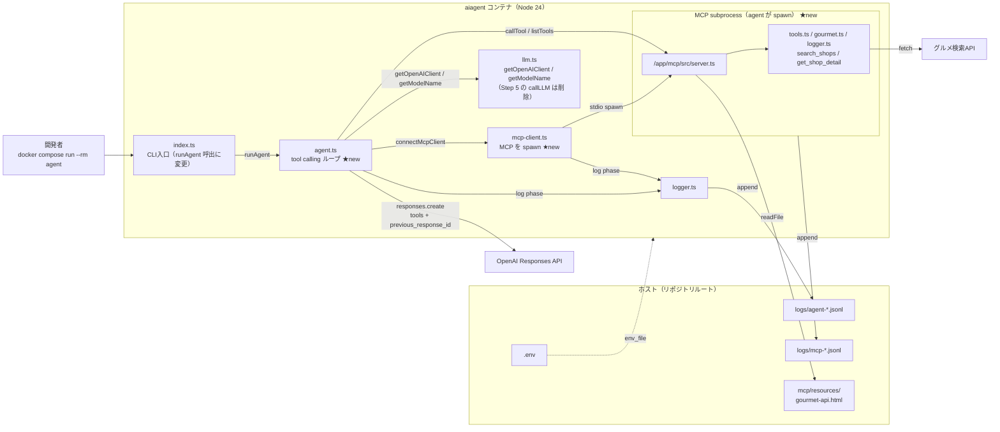
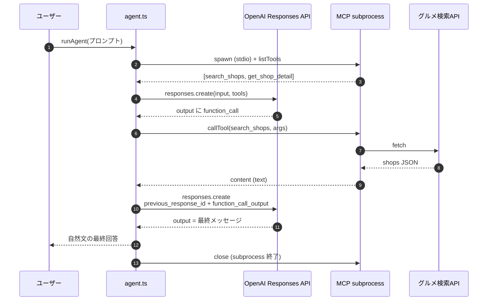

# Step 6: Agent-MCP tool calling ループ連携

> 上から順に読んで、コマンド・ファイル内容をそのままコピペすれば完了します。
> **受講者が「実在の沖縄の店が返ってくる」体験をする最初のステップ**。
> このStepから「自由実験節」で好きな質問を投げて遊べます。

## このStepで作るもの

### Step 6 完了時点のディレクトリ構造

```text
aiagent-handson/
├── .env
├── .env.example
├── .gitignore
├── docker-compose.yml        ← 更新（このStep、agent に ./mcp:/app/mcp:ro 追加）
├── logs/
│   ├── mcp-<timestamp>.jsonl     ← 複数発生（Agentが毎回spawn）
│   └── agent-<timestamp>.jsonl
├── aiagent/
│   ├── Dockerfile
│   ├── package.json          ← 更新（@modelcontextprotocol/sdk 追加）
│   ├── tsconfig.json
│   └── src/
│       ├── index.ts          ← 更新（runAgent 経由に切替）
│       ├── llm.ts            ← 更新（callLLM削除、getClient/getModel に）
│       ├── logger.ts
│       ├── mcp-client.ts     ← 新規（このStep、MCP spawn）
│       └── agent.ts          ← 新規（このStep、tool calling ループ）
└── mcp/
    ├── ... (Step 4 完了状態のまま)
```

### 作成・更新ファイル

- `aiagent/package.json`: `@modelcontextprotocol/sdk` 追加（Client 使用のため）
- `aiagent/src/mcp-client.ts`: `StdioClientTransport` で MCP サーバーを spawn
- `aiagent/src/agent.ts`: Responses API の tools 付きリクエスト、`function_call` 検出、MCP 経由の実行、`function_call_output` による再推論、MAX_TURNS ガード
- `aiagent/src/llm.ts`: `callLLM` を削除、`getOpenAIClient` / `getModelName` に軽量化
- `aiagent/src/index.ts`: `runAgent(userInput)` を呼ぶ形に
- `docker-compose.yml`: agent サービスに `./mcp:/app/mcp:ro` マウント追加

## 構成図

Step 6 は **Agent と MCP が初めて繋がる** ステップ。重要なのは、
MCP は別コンテナではなく **agent コンテナ内で stdio サブプロセスとして spawn** される点。
`./mcp:/app/mcp:ro` マウントにより agent の Node が MCP ソースと `node_modules` の両方を解決できる。
追加・新規分は ★new で示す。



### tool calling ループのシーケンス



### Step 5 からの差分

| 追加/変更点 | ファイル | 役割 |
|---|---|---|
| tool calling ループ | `aiagent/src/agent.ts` ★new | `function_call` → MCP 実行 → `function_call_output` の往復、`MAX_TURNS=4` |
| MCP spawn ヘルパ | `aiagent/src/mcp-client.ts` ★new | `StdioClientTransport` で `/app/mcp/src/server.ts` を子プロセス起動 |
| llm.ts 軽量化 | `aiagent/src/llm.ts` | `callLLM` を削除し `getOpenAIClient` / `getModelName` に |
| エントリ差替 | `aiagent/src/index.ts` | `runAgent(userInput)` を呼ぶ形に |
| MCP ソース共有 | `docker-compose.yml` | agent サービスに `./mcp:/app/mcp:ro` マウント追加 |
| MCP SDK 依存 | `aiagent/package.json` | `@modelcontextprotocol/sdk` を追加（Client 側） |

### 押さえておきたい 4 点

1. **MCP は subprocess として agent コンテナ内で動く**。docker-compose の `mcp` サービス
   （`depends_on` で起動するもの）はこの Step では実質使われない。stdio サブプロセス
   パターンに切り替わっている。
2. **`/app/mcp/src/server.ts` の置き場所が重要**。`/mcp` 直下に置くと Node の ESM 解決が
   `/app/node_modules` まで到達しない。`NODE_PATH` は ESM では無視されるので、配置で解決する。
3. **Responses API は `previous_response_id` で会話状態を OpenAI に預ける**。
   Chat Completions API のように `messages[]` を自分で積む必要はない。
4. **`MAX_TURNS=4` は暴走保険**。LLM が毎ターン tool を呼び続けるような壊れ方をしても
   コストが無限に膨らまないようにする。本番では 10〜20 が現実的。

## 完了条件

- `docker compose run --rm agent npm run dev -- "<質問>"` で **AgentがMCPツールを呼び出して、実在の店舗情報を含む回答を返す**
- Terminal B で agent 側と mcp 側のログが時系列で交互に出ることを確認できる

## 所要時間

約 30 分

## 前提条件

- Step 5 完了済み（Agent が LLM と疎通している）
- Step 4 完了済み（MCP サーバーが `search_shops` / `get_shop_detail` を提供）
- `.env` に `OPENAI_API_KEY` / `GOURMET_API_KEY` 設定済み

---

## 手順

### 1. ディレクトリに移動

```bash
cd aiagent-handson/
```

### 2. `aiagent/package.json` に MCP SDK を追加

Step 5 の `package.json` に `@modelcontextprotocol/sdk` を追加して上書き:

```bash
cat > aiagent/package.json << 'EOF'
{
  "name": "aiagent",
  "version": "0.1.0",
  "private": true,
  "type": "module",
  "description": "会食ムキムキ君 AI Agent",
  "scripts": {
    "dev": "node src/index.ts"
  },
  "engines": {
    "node": ">=24"
  },
  "dependencies": {
    "@modelcontextprotocol/sdk": "^1.29.0",
    "openai": "^6.34.0",
    "zod": "^4.3.6"
  }
}
EOF
```

**ポイント**:
- MCP SDK は **MCP サーバー側だけでなく、Agent 側の Client でも必要**
- 同じ `^1.29.0` を両方に入れて整合性を保つ

### 3. `docker-compose.yml` に MCP ソースの共有を追加

```bash
cat > docker-compose.yml << 'EOF'
services:
  mcp:
    build:
      context: ./mcp
    working_dir: /app
    volumes:
      - ./mcp:/app
      - /app/node_modules
      - ./logs:/app/logs
    env_file:
      - .env

  agent:
    build:
      context: ./aiagent
    working_dir: /app
    volumes:
      - ./aiagent:/app
      - /app/node_modules
      - ./logs:/app/logs
      # Agent が MCP を stdio で spawn できるよう、MCP ソースを read-only で共有。
      # /app/mcp 配下に置くことで、MCPサブプロセスが @modelcontextprotocol/sdk を
      # /app/node_modules から Node の標準ESM解決で辿れる
      - ./mcp:/app/mcp:ro
    env_file:
      - .env
    depends_on:
      - mcp
EOF
```

**ポイント**:
- **`/app/mcp` に置くのが重要**。`/mcp` に置くと Node の ESM 解決が `/app/node_modules` まで到達しない
- `:ro`（read-only）で、MCP のソースを Agent コンテナから書き換えできない設計
- NODE_PATH 環境変数は ESM module resolution では効かないので使わない

### 4. `aiagent/src/llm.ts` を再設計（軽量ヘルパーに）

```bash
cat > aiagent/src/llm.ts << 'EOF'
/**
 * OpenAI クライアントとモデル名のヘルパー
 *
 * Step 6 以降は agent.ts が直接 client.responses.create を呼ぶため、
 * ここでは「クライアント初期化」と「モデル名取得」だけを担う薄い層にする。
 */

import OpenAI from "openai";

let _client: OpenAI | null = null;

export function getOpenAIClient(): OpenAI {
  if (_client) return _client;
  const apiKey = process.env.OPENAI_API_KEY;
  if (!apiKey) {
    throw new Error("OPENAI_API_KEY is not set");
  }
  _client = new OpenAI({ apiKey });
  return _client;
}

export function getModelName(): string {
  return process.env.OPENAI_MODEL ?? "gpt-4.1-mini";
}
EOF
```

**ポイント**:
- Step 5 の `callLLM(input)` は削除。制御ループは agent.ts に集約
- クライアント・モデル名は複数の箇所で使うので「取得関数」として分離

### 5. `aiagent/src/mcp-client.ts` を新規作成

```bash
cat > aiagent/src/mcp-client.ts << 'EOF'
/**
 * MCP クライアント接続ヘルパ
 *
 * Agent コンテナ内から /app/mcp/src/server.ts を子プロセスとして spawn し、
 * stdio で MCPサーバーに接続する。
 *
 * - MCP ソースは docker-compose の volume で /app/mcp:ro にマウント
 * - /app/mcp/src/server.ts から `@modelcontextprotocol/sdk` を import すると
 *   Node のESM解決が /app/mcp/node_modules → /app/node_modules と辿り
 *   agent の node_modules にインストール済みの SDK を発見する
 *   （/app 配下に置くことがポイント。NODE_PATH は ESM では効かない）
 */

import { Client } from "@modelcontextprotocol/sdk/client/index.js";
import { StdioClientTransport } from "@modelcontextprotocol/sdk/client/stdio.js";
import { log } from "./logger.ts";

export async function connectMcpClient(): Promise<Client> {
  const transport = new StdioClientTransport({
    command: "node",
    args: ["/app/mcp/src/server.ts"],
    env: {
      ...(process.env as Record<string, string>),
      // MCP が グルメ検索API を呼ぶために必要
      GOURMET_API_KEY: process.env.GOURMET_API_KEY ?? "",
      // MCP のログも logs/ に書かれるよう LOG_DIR を明示
      LOG_DIR: process.env.LOG_DIR ?? "/app/logs",
    },
  });

  const client = new Client(
    { name: "kaishoku-mukimuki-agent", version: "0.1.0" },
    { capabilities: {} }
  );

  await client.connect(transport);
  log("mcp_connected", {});

  return client;
}
EOF
```

**ポイント**:
- `StdioClientTransport` は「指定したコマンドを子プロセスで起動」する。`command: "node"`, `args: [...]` で MCP サーバーを実行
- **環境変数の明示的な引き継ぎが重要**。`process.env` を spread するだけでなく、`GOURMET_API_KEY` などは明示しておくと変更時に目に付きやすい
- `LOG_DIR` を渡さないと MCP 側のログが予期せぬ場所に書かれる

### 6. `aiagent/src/agent.ts` を新規作成（本丸）

```bash
cat > aiagent/src/agent.ts << 'EOF'
/**
 * Agent 制御ループ（OpenAI Responses API + MCP tool calling）
 *
 * 流れ:
 *   1. MCP に接続して tools/list を取得
 *   2. Responses API に tools を渡して初回リクエスト
 *   3. output に function_call があれば MCP で実行 → function_call_output で再推論
 *   4. tool_calls が無くなれば最終回答を返す
 *   5. MAX_TURNS 超過で例外
 */

import type { Client } from "@modelcontextprotocol/sdk/client/index.js";
import { getModelName, getOpenAIClient } from "./llm.ts";
import { log } from "./logger.ts";
import { connectMcpClient } from "./mcp-client.ts";

const MAX_TURNS = 4;

interface McpTool {
  name: string;
  description?: string;
  inputSchema: Record<string, unknown>;
}

interface ResponseFunctionCallItem {
  type: "function_call";
  name: string;
  call_id: string;
  arguments: string;
}

function isFunctionCallItem(
  item: unknown
): item is ResponseFunctionCallItem {
  return (
    typeof item === "object" &&
    item !== null &&
    (item as { type?: unknown }).type === "function_call"
  );
}

function toOpenAITool(mcpTool: McpTool): Record<string, unknown> {
  return {
    type: "function",
    name: mcpTool.name,
    description: mcpTool.description ?? "",
    parameters: mcpTool.inputSchema,
  };
}

function extractText(result: unknown): string {
  const content = (result as { content?: unknown }).content;
  if (!Array.isArray(content)) return "";
  return content
    .filter(
      (c: unknown): c is { type: "text"; text: string } =>
        typeof c === "object" &&
        c !== null &&
        (c as { type?: unknown }).type === "text" &&
        typeof (c as { text?: unknown }).text === "string"
    )
    .map((c) => c.text)
    .join("\n");
}

function safeParseArgs(s: string | undefined): Record<string, unknown> {
  if (!s) return {};
  try {
    return JSON.parse(s) as Record<string, unknown>;
  } catch {
    return {};
  }
}

export async function runAgent(userInput: string): Promise<string> {
  const client = getOpenAIClient();
  const model = getModelName();
  const mcp: Client = await connectMcpClient();

  try {
    const toolsList = await mcp.listTools();
    const tools = toolsList.tools.map((t) =>
      toOpenAITool({
        name: t.name,
        description: t.description,
        inputSchema: t.inputSchema as Record<string, unknown>,
      })
    );
    log("agent_start", {
      tool_names: toolsList.tools.map((t) => t.name),
    });

    log("llm_request", { turn: 1, model, input_length: userInput.length });
    let response = await client.responses.create({
      model,
      input: userInput,
      // eslint-disable-next-line @typescript-eslint/no-explicit-any
      tools: tools as any,
    });
    log("llm_response", {
      turn: 1,
      response_id: response.id,
      output_kinds: response.output.map((o) => o.type),
    });

    for (let turn = 1; turn <= MAX_TURNS; turn += 1) {
      const toolCalls = response.output.filter(isFunctionCallItem);

      if (toolCalls.length === 0) {
        const finalText = response.output_text ?? "";
        log("agent_done", { turns: turn, content_length: finalText.length });
        return finalText;
      }

      const toolOutputs: Array<{
        type: "function_call_output";
        call_id: string;
        output: string;
      }> = [];

      for (const call of toolCalls) {
        const args = safeParseArgs(call.arguments);
        log("tool_call", {
          turn,
          name: call.name,
          args,
          call_id: call.call_id,
        });

        const toolResult = await mcp.callTool({
          name: call.name,
          arguments: args,
        });

        const resultText = extractText(toolResult);
        const isError = (toolResult as { isError?: unknown }).isError === true;

        log("tool_result", {
          turn,
          name: call.name,
          call_id: call.call_id,
          isError,
          preview: resultText.slice(0, 200),
        });

        toolOutputs.push({
          type: "function_call_output",
          call_id: call.call_id,
          output: resultText,
        });
      }

      log("llm_request", {
        turn: turn + 1,
        tool_outputs: toolOutputs.length,
      });
      response = await client.responses.create({
        model,
        previous_response_id: response.id,
        // eslint-disable-next-line @typescript-eslint/no-explicit-any
        input: toolOutputs as any,
        // eslint-disable-next-line @typescript-eslint/no-explicit-any
        tools: tools as any,
      });
      log("llm_response", {
        turn: turn + 1,
        response_id: response.id,
        output_kinds: response.output.map((o) => o.type),
      });
    }

    throw new Error(`Max turns (${MAX_TURNS}) exceeded`);
  } finally {
    await mcp.close();
  }
}
EOF
```

**ポイント（勘どころそのもの）**:
- **MAX_TURNS=4** で無限ループを防ぐ。LLMが常に tool を呼び続ける壊れ方への保険
- **`previous_response_id` で会話状態を OpenAI に預ける**。ローカルで messages 配列を管理しなくて済む
- `function_call` と `function_call_output` は Responses API 固有の形式。Chat Completions API の `tool_calls` / `role:tool` とは別物
- `isFunctionCallItem` 型ガードで `output[]` 要素を安全に判別
- MCP の `isError: true` は `tool_result` の `isError` としてログに残す。LLMには文字列として渡される
- `finally` で `mcp.close()`。例外が出ても子プロセスをリーク しない

### 7. `aiagent/src/index.ts` を `runAgent` 呼び出しに切替

```bash
cat > aiagent/src/index.ts << 'EOF'
/**
 * Agent CLI 入口
 *
 * 使い方:
 *   docker compose run --rm agent npm run dev -- "<プロンプト>"
 *
 * Step 6: runAgent() 経由で MCP ツールを使った tool calling ループを実行。
 */

import { runAgent } from "./agent.ts";
import { log } from "./logger.ts";

async function main() {
  const userInput = process.argv.slice(2).join(" ").trim();
  if (!userInput) {
    console.error('Usage: npm run dev -- "<prompt>"');
    process.exit(1);
  }

  log("input", { prompt: userInput });

  try {
    const answer = await runAgent(userInput);
    console.log(answer);
    log("final", { content_length: answer.length });
  } catch (err) {
    const message = err instanceof Error ? err.message : String(err);
    log("error", { phase: "main", message });
    console.error("[agent] error:", message);
    process.exit(1);
  }
}

main();
EOF
```

### 8. Docker イメージを再ビルド

```bash
docker compose build agent
```

MCP SDK 追加分で依存パッケージが増えるため、ビルドが必要です。

---

## 動作確認

```bash
docker compose run --rm agent npm run dev -- "沖縄でタンパク質が取れる鶏料理の店を教えて"
```

期待する結果（9秒程度）:
- LLM が自動的に `search_shops` を呼ぶ
- グルメ検索API 経由で **実在の沖縄の店**が取得される
- 2ターンで完結（1回目: tool_call、2回目: 最終メッセージ）
- 応答に店舗名・住所・予算・URL が含まれる

期待する出力（抜粋、店舗は変化します）:

```
沖縄でタンパク質が取れる鶏料理の店をいくつかご紹介します。

1. とりいちず 与那原店
- 住所: 沖縄県島尻郡与那原町上与那原336　ウイングビル与那原2階
- ジャンル: 居酒屋（鶏料理専門店の水炊き）
- 予算: 1501～2000円
- URL: <店舗詳細URL>

2. とりいちず 沖縄胡屋店
...
```

これが出れば **Step 6 完了**。**Agentが本当に動いた**瞬間です。

---

## ログ観察タブ（Terminal B）

### このStepで増えるログ phase

Agent 側:

| phase | 出るタイミング | 何が分かる |
|---|---|---|
| `agent_start` | MCP接続+tools取得完了時 | 取得した tool 名一覧 |
| `mcp_connected` | MCPサーバー接続完了 | 接続成功 |
| `llm_request` | Responses API 送信直前（複数回） | turn番号とtools数 |
| `llm_response` | Responses API 受信直後（複数回） | output種別（function_call か message か） |
| `tool_call` | LLM が tool を呼ぶと決めた瞬間 | ツール名と LLM が組み立てた引数 |
| `tool_result` | MCP がツール実行を返してきた瞬間 | 結果の先頭200文字プレビュー |
| `agent_done` | tool_call が無くなり最終応答確定 | 総ターン数 |

MCP 側のログ（`mcp-*.jsonl`）もこの間に自然に混ざって出ます。

### Terminal B で実行するコマンド

```bash
cd aiagent-handson/
# Agent + MCP 両方見る
tail -F logs/*.jsonl 2>/dev/null
# jq 整形版（source別に色分けイメージ）
tail -F logs/*.jsonl 2>/dev/null | jq -r '"\(.ts) [\(.source):\(.phase)] \(. | del(.ts, .source, .phase) | tostring)"'
```

### 観察ポイント

- **source 列が `agent` と `mcp` で交互**に出る（tool call が境界）
- agent 側の `tool_call` → mcp 側の `call_tool_received` → `gourmet_api_request` → `gourmet_api_response` → `call_tool_done` → agent 側の `tool_result` の**因果関係**が時系列で見える
- `call_id` が agent の `tool_call` と `tool_result` で一致（対応関係の検証）
- **`desc` フィールド**（Step 2 で導入）で各 phase の役割が日本語で即読める。例:
  - `"desc":"LLMがツール呼び出しを決定"` → ここでLLMが search_shops を選んだ
  - `"desc":"グルメ検索API へリクエスト送信"` → 外部APIを叩いている
  - `"desc":"MCPからツール実行結果を受信"` → 結果がLLMに戻る直前

---

## 自由実験（3〜5分）

**ここからは好きな自然言語プロンプトを試せます。**

### おすすめ質問例

```bash
# シンプルな要望
docker compose run --rm agent npm run dev -- "沖縄で刺身が美味しい店を3つ教えて"

# 予算制約付き
docker compose run --rm agent npm run dev -- "1人3000円で行ける沖縄の居酒屋を教えて"

# ジャンルを絞る
docker compose run --rm agent npm run dev -- "沖縄の個室のある焼肉屋ある？"

# 詳細情報を問う（get_shop_detail が呼ばれるはず）
docker compose run --rm agent npm run dev -- "沖縄のステーキハウスで人気の店を1軒、営業時間まで教えて"
```

### 観察ポイント

**Terminal B で以下を見比べてください**:

1. **LLM がどのツールを選ぶか**
   - search_shops だけ？ get_shop_detail も呼ばれる？
2. **引数の組み立て方**
   - `keyword` に何を入れるか（"刺身" or "海鮮" など）
   - `count` を要望件数に合わせて変えるか
   - `budget` を使うか（LLMが グルメ 予算コードを知っているかは微妙）
3. **ターン数**
   - 1 tool で終わるか、2 tools チェーンするか
4. **回答の粒度**
   - Step 7 ではこれを「**健康キーワードでフィルタ**」するので、今は**フィルタ無しの素の回答**を見ておく

### ハルシネーションの残存を観察

LLM の判断にはまだ**ブレ**があります:
- count が 10 固定で、3件要望でも10件取って自分で絞る場合あり
- budget コードを推測して渡してしまう場合あり（"B002"など）
- tool を呼ばず LLM の知識だけで答える場合もある（稀）

これらは **Step 7 で system prompt やフィルタを足すと制御できる**という学びにつながります。

---

## トラブルシュート

| 症状 | 原因候補 | 対処 |
|---|---|---|
| `ERR_MODULE_NOT_FOUND: Cannot find package "@modelcontextprotocol/sdk"` | MCP spawn パス or NODE_PATH の問題 | `/app/mcp/src/server.ts` に揃っているか確認。/mcp （/app 無し）はNG |
| `MCP error -32000: Connection closed` | MCPサブプロセスがすぐ落ちた | 別ターミナルで `docker compose run --rm agent node /app/mcp/src/server.ts` を単独実行してエラー内容を見る |
| `OPENAI_API_KEY is not set` | `.env` 未読込 | `env_file: .env` を確認 |
| `Max turns (4) exceeded` | LLM が tool を呼び続けて終わらない | プロンプトを具体化、MAX_TURNS を8等に増やす判断も |
| 対話は返るが tool が呼ばれない | プロンプトが tool を呼ぶ誘導になっていない | 「沖縄で〜」「店を検索して」などツール利用が必然になる文言にする |

---

## このStepでの勘どころ

1. **MCPサブプロセスの node_modules 解決は配置で決まる**
   - `/app/mcp/src/server.ts` → 祖先の `/app/node_modules` を見つける
   - `/mcp/src/server.ts` → `/node_modules` までしか見ないので NG
   - Node ESM の **package resolution アルゴリズムは NODE_PATH を無視する**
   - 分離配置ではなく「**ある親の node_modules を共有する構造にする**」のが定石

2. **Responses API の tool calling フロー**
   - `client.responses.create({ tools, input })` で初回
   - 返ってきた `response.output[]` から `function_call` を抽出
   - ツール実行結果を `function_call_output` の input 配列で返す
   - `previous_response_id` で OpenAI 側が会話状態を保持（messagesを自作しない）

3. **MAX_TURNS は無限ループへの保険**
   - LLMが壊れて毎ターン tool を呼び続けると API コストが爆発
   - 4 は学習用に小さめ。本番では10〜20が現実的
   - 超過時は例外にして、呼び出し側で「ユーザーに謝る」など方針決定

4. **ツール結果テキスト化は Agent 側の責務**
   - MCP の `content: [{type:'text', text:'...'}]` を1つの string に
   - バイナリや複数メディア対応は将来ライブラリ化する余地

5. **log() の `call_id` を残すことで対応付けが取れる**
   - `tool_call` と `tool_result` が **同じ `call_id`** で紐付く
   - 複数ツールが並列に呼ばれたときにどれがどれの結果か追跡可能
   - 本番運用の監査・デバッグに効く

---

## コミット

### 実装コミット（feat）

```bash
git add aiagent/package.json \
        aiagent/src/index.ts \
        aiagent/src/llm.ts \
        aiagent/src/agent.ts \
        aiagent/src/mcp-client.ts \
        docker-compose.yml

git commit -m "feat: Step6 Agent-MCP tool callingループ連携"
```

### 手順書コミット（docs）

```bash
git add procedure-docs/step-06-tool-loop.md \
        dev-plan-v2.md

git commit -m "docs: Step6 手順書追加"
```

---

## やってみる ✨

### 今できるようになったこと

- **Agent に自然言語で話しかけると、MCP経由で グルメ検索API を叩いて実在の店が返ってくる**
- **LLM が自動的にツールを選択し、引数を組み立てる**様子が可視化できる
- tool_call → tool_result → 最終応答 の **因果関係が Terminal B で時系列で追える**
- Step 5 との違い: **ハルシネーションが消え、根拠あるデータで回答**

### 1分でできる確認

**Terminal B**（別タブ）:

```bash
cd aiagent-handson/
tail -F logs/*.jsonl 2>/dev/null
```

**Terminal A**:

```bash
docker compose run --rm agent npm run dev -- "沖縄でタンパク質が取れる鶏料理の店を教えて"
```

Terminal A に **実在の店舗名・住所・URL付きの回答**が出て、
Terminal B に **agent 側と mcp 側のログが時系列で交互**に流れたら大成功。

---

## 次のStep

→ [Step 7: 健康判定ロジック統合](./step-07-healthy-filter.md)（Step 7 完了後に作成）
