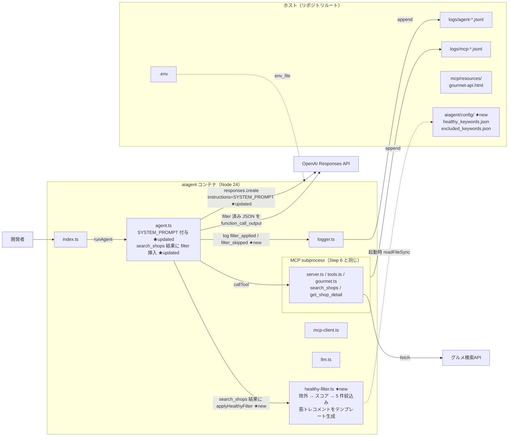

# Step 7: 健康判定ロジック統合（5件 + 筋トレ観点コメント）

> 上から順に読んで、コマンド・ファイル内容をそのままコピペすれば完了します。
> **「会食ムキムキ君」としての完成形**。Step 6 との差分でフィルタの効果を体感します。

## このStepで作るもの

### Step 7 完了時点のディレクトリ構造

```text
aiagent-handson/
├── .env
├── .env.example
├── .gitignore
├── docker-compose.yml
├── logs/
│   ├── mcp-<timestamp>.jsonl
│   └── agent-<timestamp>.jsonl
├── aiagent/
│   ├── Dockerfile
│   ├── package.json
│   ├── tsconfig.json
│   ├── config/                       ← 新規（このStep）
│   │   ├── healthy_keywords.json     ← 新規（このStep、3カテゴリ辞書）
│   │   └── excluded_keywords.json    ← 新規（このStep、除外辞書）
│   └── src/
│       ├── index.ts
│       ├── llm.ts
│       ├── logger.ts
│       ├── mcp-client.ts
│       ├── agent.ts                  ← 更新（このStep、filter統合+SYSTEM_PROMPT）
│       └── healthy-filter.ts         ← 新規（このStep、決定的判定ロジック）
└── mcp/
    ├── ... (Step 4 完了状態のまま、MCP側は変更なし)
```

### 作成・更新ファイル

- `aiagent/config/healthy_keywords.json` — PRD §8 の3カテゴリ辞書
- `aiagent/config/excluded_keywords.json` — 除外語
- `aiagent/src/healthy-filter.ts` — 店舗配列を受け取り、カテゴリ判定・スコア付け・5件絞込み・筋トレコメント生成
- `aiagent/src/agent.ts` 更新 — `search_shops` の結果に filter を挟む、SYSTEM_PROMPT で指示

## 構成図

Step 7 は「**会食ムキムキ君**」としての完成形。
Step 6 の tool calling ループの **tool_result と function_call_output の間に決定的フィルタ**を
差し込む形。LLM には **フィルタ済み 5 件以内** の JSON だけが渡るので、応答は必ず
ヒットキーワードと筋トレコメントを含むようになる。追加・更新分は ★new / ★updated で示す。



### ツール結果処理のどこに filter が入るか

Step 6 は tool_result の文字列をそのまま `function_call_output` として返していた。
Step 7 では `call.name === "search_shops"` の場合だけ JSON を `applyHealthyFilter` に通し、
結果を再シリアライズしてから `function_call_output` に入れる。LLM からは
「search_shops が 5 件以内の健康キーワード付き JSON を返す」ように見える。

```
tool_result (生の shops JSON)
    ↓
  [applyHealthyFilter] ★new  ← 除外 → スコア → 上位5件 → muscle_comment 付与
    ↓
function_call_output (filter 済み JSON)
    ↓
OpenAI Responses API (最終自然文を生成)
```

### Step 6 からの差分

| 追加/変更点 | ファイル | 役割 |
|---|---|---|
| 健康キーワード辞書 | `aiagent/config/healthy_keywords.json` ★new | `high_protein` / `low_fat_method` / `healthy_pitch` の 3 カテゴリ |
| 除外キーワード辞書 | `aiagent/config/excluded_keywords.json` ★new | 食べ放題・デカ盛り・こってりを早期除外 |
| 決定的フィルタ | `aiagent/src/healthy-filter.ts` ★new | 店舗配列を受け取り 5 件絞込み + 筋トレコメント生成（LLM 非依存） |
| SYSTEM_PROMPT | `aiagent/src/agent.ts` ★updated | 初回 `responses.create` に `instructions` として渡す |
| filter 挿入 | `aiagent/src/agent.ts` ★updated | `search_shops` の tool_result を `function_call_output` に入れる直前で filter |

### 押さえておきたい 3 点

1. **LLM 判断とコード制御の責務分離**。除外・5 件絞込み・筋トレコメントは**コード側（決定的）**、
   検索クエリ組み立てと自然文整形は**LLM 側**。再現性が求められる業務要件はコードで保証する。
2. **`muscle_comment` はテンプレート生成**にしてある。LLM に書かせると毎回微妙に揺れるので、
   同じ店舗・同じヒット単語なら必ず同じコメントになるように決定的にしている。
3. **SYSTEM_PROMPT は初回の `responses.create` だけに渡せばよい**。
   `previous_response_id` を使う 2 回目以降は OpenAI 側が会話状態として保持するので
   `instructions` を毎回送る必要はない。

## 完了条件

- `docker compose run --rm agent npm run dev -- "<健康会食の質問>"` で:
  - 返却件数 **5件以内**
  - 各候補に **ヒットキーワード（健康キーワード）が理由として明記**
  - 各候補に **筋トレ観点コメント**が付与される
- Terminal B で `filter_applied` phase を確認できる（何件→何件に絞られたか）

## 所要時間

約 25 分

## 前提条件

- Step 6 完了済み（Agent が MCP 経由で実在の店を返せる）
- `aiagent/src/agent.ts` が Step 6 時点の tool calling ループ実装を持っている

---

## 手順

### 1. ディレクトリに移動

```bash
cd aiagent-handson/
```

### 2. `aiagent/config/` を作成し、健康キーワード辞書を置く

```bash
mkdir -p aiagent/config

cat > aiagent/config/healthy_keywords.json << 'EOF'
{
  "high_protein": [
    "高たんぱく",
    "タンパク質",
    "鶏むね",
    "赤身",
    "魚介",
    "刺身"
  ],
  "low_fat_method": [
    "グリル",
    "蒸し",
    "茹で",
    "炙り",
    "低脂質"
  ],
  "healthy_pitch": [
    "ヘルシー",
    "サラダ",
    "野菜",
    "糖質オフ",
    "健康志向"
  ]
}
EOF
```

**ポイント**:
- **3カテゴリに分ける**ことで「何のために選ばれたか」を説明可能にする
- PRD §10 の優先順位（高タンパク > 低脂質 > 野菜系）はコード側でスコアリング
- 辞書が外出しになっていると、コード変更なしでキーワード追加・削除できる

### 3. 除外キーワード辞書を置く

```bash
cat > aiagent/config/excluded_keywords.json << 'EOF'
{
  "excluded": [
    "食べ放題",
    "デカ盛り",
    "こってり"
  ]
}
EOF
```

**ポイント**:
- 「健康会食に明らかに不向きな店」を早期に落とす
- LLM に混ぜて説明させずに、コード側で確実に除外

### 4. `aiagent/src/healthy-filter.ts` を新規作成

```bash
cat > aiagent/src/healthy-filter.ts << 'EOF'
/**
 * 健康会食候補判定フィルタ
 *
 * PRD §8/10 に基づく決定的ロジック:
 * - 判定対象フィールド: 店舗名 / ジャンル名・キャッチ / キャッチ
 * - カテゴリ: 高タンパク > 低脂質/調理法 > ヘルシー訴求 の優先順位
 * - 除外キーワード（食べ放題・デカ盛り・こってり）を含む店舗は除外
 * - 上位5件を返す
 * - 各候補に「筋トレ観点コメント」を決定的テンプレートで付与
 */

import { readFileSync } from "node:fs";
import { fileURLToPath } from "node:url";
import { dirname, join } from "node:path";

const __dirname = dirname(fileURLToPath(import.meta.url));
const CONFIG_DIR = join(__dirname, "..", "config");

interface HealthyKeywordsConfig {
  high_protein: string[];
  low_fat_method: string[];
  healthy_pitch: string[];
}

interface ExcludedKeywordsConfig {
  excluded: string[];
}

const healthyKeywords: HealthyKeywordsConfig = JSON.parse(
  readFileSync(join(CONFIG_DIR, "healthy_keywords.json"), "utf8")
) as HealthyKeywordsConfig;

const excludedKeywords: ExcludedKeywordsConfig = JSON.parse(
  readFileSync(join(CONFIG_DIR, "excluded_keywords.json"), "utf8")
) as ExcludedKeywordsConfig;

const CATEGORY_SCORE: Record<string, number> = {
  high_protein: 3,
  low_fat_method: 2,
  healthy_pitch: 1,
};

export type HealthyCategory =
  | "high_protein"
  | "low_fat_method"
  | "healthy_pitch";

export interface GourmetShop {
  id?: string;
  name?: string;
  name_kana?: string;
  genre?: { name?: string; catch?: string };
  catch?: string;
  address?: string;
  urls?: { pc?: string };
  budget?: { name?: string; average?: string };
  [key: string]: unknown;
}

export interface FilteredShop extends GourmetShop {
  hit_keywords: string[];
  hit_category: HealthyCategory;
  score: number;
  muscle_comment: string;
}

function getJudgmentText(shop: GourmetShop): string {
  const parts: string[] = [];
  if (shop.name) parts.push(shop.name);
  if (shop.genre?.name) parts.push(shop.genre.name);
  if (shop.genre?.catch) parts.push(shop.genre.catch);
  if (shop.catch) parts.push(shop.catch);
  return parts.join(" ");
}

function generateMuscleComment(
  hits: string[],
  category: HealthyCategory
): string {
  if (category === "high_protein") {
    if (hits.some((k) => ["鶏むね", "赤身", "タンパク質", "高たんぱく"].includes(k))) {
      return "高タンパク・低脂質でバルク維持・筋肥大に向く";
    }
    if (hits.some((k) => ["魚介", "刺身"].includes(k))) {
      return "良質なタンパク質とオメガ3脂肪酸が摂れる";
    }
    return "高タンパクメニューが期待できる";
  }
  if (category === "low_fat_method") {
    return "脂質控えめな調理法で、減量期のPFCバランスに向く";
  }
  if (category === "healthy_pitch") {
    return "野菜・ヘルシー志向で、副菜とのバランスが取りやすい";
  }
  return "";
}

export function applyHealthyFilter(
  shops: GourmetShop[],
  maxCount = 5
): FilteredShop[] {
  const results: FilteredShop[] = [];

  for (const shop of shops) {
    const text = getJudgmentText(shop);

    if (excludedKeywords.excluded.some((ex) => text.includes(ex))) {
      continue;
    }

    const hitsByCategory: Record<HealthyCategory, string[]> = {
      high_protein: [],
      low_fat_method: [],
      healthy_pitch: [],
    };
    for (const kw of healthyKeywords.high_protein) {
      if (text.includes(kw)) hitsByCategory.high_protein.push(kw);
    }
    for (const kw of healthyKeywords.low_fat_method) {
      if (text.includes(kw)) hitsByCategory.low_fat_method.push(kw);
    }
    for (const kw of healthyKeywords.healthy_pitch) {
      if (text.includes(kw)) hitsByCategory.healthy_pitch.push(kw);
    }

    const totalHits =
      hitsByCategory.high_protein.length +
      hitsByCategory.low_fat_method.length +
      hitsByCategory.healthy_pitch.length;
    if (totalHits === 0) continue;

    let hitCategory: HealthyCategory;
    if (hitsByCategory.high_protein.length > 0) {
      hitCategory = "high_protein";
    } else if (hitsByCategory.low_fat_method.length > 0) {
      hitCategory = "low_fat_method";
    } else {
      hitCategory = "healthy_pitch";
    }

    const score =
      hitsByCategory.high_protein.length * CATEGORY_SCORE.high_protein +
      hitsByCategory.low_fat_method.length * CATEGORY_SCORE.low_fat_method +
      hitsByCategory.healthy_pitch.length * CATEGORY_SCORE.healthy_pitch;

    const allHits = [
      ...hitsByCategory.high_protein,
      ...hitsByCategory.low_fat_method,
      ...hitsByCategory.healthy_pitch,
    ];

    results.push({
      ...shop,
      hit_keywords: allHits,
      hit_category: hitCategory,
      score,
      muscle_comment: generateMuscleComment(allHits, hitCategory),
    });
  }

  results.sort((a, b) => b.score - a.score);
  return results.slice(0, maxCount);
}
EOF
```

**ポイント**:
- **判定対象は3フィールドに限定**（店舗名 / ジャンル名・キャッチ / キャッチ）
- 除外判定を先に回し、次にカテゴリ判定。**不要な計算を省く**
- スコアリング: 高タンパク=3点、低脂質=2点、野菜=1点を**ヒット数と掛けて合算**
- `muscle_comment` は**LLMに任せず決定的テンプレート**で生成（再現性重視、PRD の必須要件）
- 辞書は起動時に1回だけ読む（毎回read不要）

### 5. `aiagent/src/agent.ts` を更新

既存のファイルを開いて、以下の変更を加えます:

#### 5-1. import を追加

ファイル冒頭の import 群に追記:

```typescript
import { applyHealthyFilter, type GourmetShop } from "./healthy-filter.ts";
```

#### 5-2. SYSTEM_PROMPT を追加

`MAX_TURNS` の定数宣言の直後に追記:

```typescript
const SYSTEM_PROMPT = `あなたは「会食ムキムキ君」という AI アシスタントです。
筋肉づくり・健康維持に配慮した沖縄の会食候補を提案する役割を担います。

ツール search_shops を呼ぶとき、返却結果には以下の追加フィールドが含まれます:
- hit_keywords: その店舗でヒットした健康キーワードのリスト（必ず回答に含めること）
- hit_category: 最優先カテゴリ（high_protein / low_fat_method / healthy_pitch）
- muscle_comment: 筋トレ観点コメント（必ず回答に含めること）

返却ルール:
- 各候補について、店舗名・住所・ジャンル・予算・URL を記載
- **ヒットキーワード（hit_keywords）を理由として必ず明記**
- **筋トレ観点コメント（muscle_comment）を必ず添える**
- 候補が0件の場合は「条件に一致する健康会食候補なし」と返す
- 提供された店舗情報の範囲で回答し、事実を創作しない`;
```

#### 5-3. 初回の `client.responses.create` に `instructions` を追加

`runAgent` 内の最初の `client.responses.create` 呼び出しを修正:

```typescript
let response = await client.responses.create({
  model,
  instructions: SYSTEM_PROMPT,   // ← 追加
  input: userInput,
  tools: tools as any,
});
```

**2回目以降の `client.responses.create`（`previous_response_id` 使用）には `instructions` は不要**。OpenAI 側が会話状態に含めて保持します。

#### 5-4. tool_result に filter を挟む

`toolOutputs.push(...)` を呼ぶ直前に filter 適用ロジックを追加:

```typescript
log("tool_result", {
  turn,
  name: call.name,
  call_id: call.call_id,
  isError,
  preview: resultText.slice(0, 200),
});

// search_shops の結果には健康判定フィルタを適用する（決定的ロジック）
let finalOutput = resultText;
if (call.name === "search_shops" && !isError) {
  try {
    const shops = JSON.parse(resultText) as GourmetShop[];
    if (Array.isArray(shops)) {
      const filtered = applyHealthyFilter(shops, 5);
      finalOutput = JSON.stringify(filtered, null, 2);
      log("filter_applied", {
        input_count: shops.length,
        output_count: filtered.length,
        hit_categories: filtered.map((s) => s.hit_category),
      });
    }
  } catch (e) {
    log("filter_skipped", {
      reason: e instanceof Error ? e.message : String(e),
    });
  }
}

toolOutputs.push({
  type: "function_call_output",
  call_id: call.call_id,
  output: finalOutput,
});
```

**ポイント**:
- **LLMに渡すのはフィルタ済みJSON**。LLMはフィルタ結果をそのまま引用するだけ
- filter 失敗時は素の結果で続行（安全フォールバック）
- `filter_applied` phase が Terminal B で観察可能

### 6. 再ビルド不要、そのまま動作確認

ファイルを追加・編集しただけで、新しい依存は入っていないので docker compose build は不要です。

---

## 動作確認

```bash
docker compose run --rm agent npm run dev -- "沖縄で会食向けに、タンパク質が取れる鶏料理の店を教えて"
```

### 期待される結果（Step 6 との差分に注目）

- **候補数が5件以内**（多くのケースで2〜3件）
- 各候補に **「ヒットキーワード」が明記**（例: 鶏、魚介、ヘルシー）
- 各候補に **「筋トレ観点コメント」が付与**（例: 「高タンパク・低脂質でバルク維持・筋肥大に向く」）
- Terminal B で `filter_applied` phase が流れ、`input_count` → `output_count` で絞り込み件数が見える

期待する応答例（抜粋）:

```
沖縄で会食向けにタンパク質が取れる鶏料理の店をご紹介します。

1. やきとり 白鳥 スワン
   - ジャンル: 居酒屋（和食）
   - キャッチ: 自家生産地鶏と若鶏の本格炭火焼鳥！
   - 住所: 沖縄県那覇市泉崎1-17-1
   - 予算: 3001～4000円
   - 特徴: 良質なタンパク質とオメガ3脂肪酸が摂れます。
   - URL: <店舗詳細URL>

2. 地鶏と島野菜 粋蓮
   - ジャンル: 居酒屋（和食）
   - 特徴: 野菜・ヘルシー志向でバランスが取りやすいです。
   - URL: <店舗詳細URL>
```

muscle_comment（「良質なタンパク質とオメガ3脂肪酸」「野菜・ヘルシー志向」）が含まれていれば **Step 7 完了**。

---

## ログ観察タブ（Terminal B）

### このStepで増えるログ phase

| phase | 出るタイミング | 何が分かる |
|---|---|---|
| `filter_applied` | search_shops の tool_result 処理中 | 入力件数・出力件数・ヒットカテゴリ分布 |
| `filter_skipped` | JSON parse エラー等 | フォールバック動作の通知 |

### Terminal B で実行するコマンド

```bash
tail -F logs/*.jsonl 2>/dev/null | jq -r '"\(.ts) [\(.source):\(.phase)] \(. | del(.ts, .source, .phase) | tostring)"'
```

### 観察ポイント

- `filter_applied` の `hit_categories` 配列で、**どのカテゴリで選ばれた店舗が多いか**が一目で分かる
  - `["high_protein", "high_protein", "healthy_pitch"]` → 高タンパク優先
  - `["healthy_pitch", "healthy_pitch"]` → 野菜系中心（鶏料理の要望なのに野菜系が多いなら入力を見直す）
- `input_count` と `output_count` の差 = フィルタで弾かれた店舗数

---

## 自由実験（3〜5分）

**Step 6 との回答差分を比較してみてください**。同じ質問でも Step 6 と Step 7 で返る内容が変わります。

### おすすめ実験

#### 実験1: Step 6 と同じ質問を投げて比較

```bash
# Step 6 で試した質問
docker compose run --rm agent npm run dev -- "沖縄でタンパク質が取れる鶏料理の店を教えて"
```

**観察ポイント**:
- 回答が5件以下になっている（Step 6 では 10 件まで）
- 各候補に muscle_comment が付く
- hit_keywords が理由として明記される
- 「とりいちず」系が3店舗あっても、同じ muscle_comment が付いて冗長に感じることがある（これは改善ポイント）

#### 実験2: 除外キーワードの効き具合を見る

```bash
docker compose run --rm agent npm run dev -- "沖縄で食べ放題のある居酒屋を教えて"
```

**観察ポイント**:
- LLM は「食べ放題」の店を返そうとする
- Agent 側の filter で「食べ放題」ヒット店が全除外される
- 結果として「条件に一致する健康会食候補なし」に近い応答になる可能性
- `filter_applied` の `input_count > output_count` の差が大きくなる

#### 実験3: ヘルシーキーワードで刺身系を呼ぶ

```bash
docker compose run --rm agent npm run dev -- "沖縄の会食で刺身や魚介が美味しい店"
```

**観察ポイント**:
- `hit_category: "high_protein"` が多くなる（刺身・魚介キーワード）
- muscle_comment が「良質なタンパク質とオメガ3脂肪酸が摂れる」になる

#### 実験4: LLM が tool を呼ばない質問

```bash
docker compose run --rm agent npm run dev -- "沖縄ってどんなところ？"
```

**観察ポイント**:
- LLM は SYSTEM_PROMPT に反し tool を呼ばないかもしれない
- `filter_applied` が出ない
- 一般的な観光案内応答になる
- これは「**会食用途にフォーカスすべき**」という設計課題の気付きになる（Step 8 の異常系テストでも扱う）

---

## トラブルシュート

| 症状 | 原因候補 | 対処 |
|---|---|---|
| `Cannot find module '../config/healthy_keywords.json'` | ファイル配置ミス | `aiagent/config/` 配下にあるか確認 |
| muscle_comment が応答に含まれない | LLM が SYSTEM_PROMPT を無視 | プロンプト文言を強めるか、model を上位版に |
| 5件を超える候補が返る | filter が効いていない | ログの `filter_applied` phase を確認、出ていなければ agent.ts の修正漏れ |
| 0件しか返らない | 検索キーワードが辞書と噛み合わない | 入力を変えて再試行、辞書を拡張 |
| `input_count=0` が続く | LLMの引数組み立てが絞りすぎ | MAX_TURNS=4 がリトライを吸収するが、超えるようならSYSTEM_PROMPTで指示追加 |

---

## このStepでの勘どころ

1. **LLM判断とコード制御の責務分離**
   - **コード側（決定的）**: 除外キーワード、5件絞込み、筋トレコメント生成
   - **LLM側（自然文整形）**: 検索クエリ組み立て、最終応答の自然文化
   - これが「**LLMの自由度とコードの決定性のバランス**」の実践例

2. **`muscle_comment` はテンプレート生成にする**
   - LLMに書かせると毎回微妙に変わる（再現性ゼロ）
   - 決定的テンプレートなら「同じ店舗・同じヒット単語 → 必ず同じコメント」
   - PRD §10「筋トレ観点コメント必須」を**コード側で保証**

3. **辞書の外出しは運用の効き目が大きい**
   - キーワード追加はコード変更不要（`healthy_keywords.json` を編集するだけ）
   - ビジネス担当がエンジニア抜きで辞書更新できる
   - テスト時にモック辞書に差し替えて behavior を検証できる

4. **SYSTEM_PROMPT は「初回のみ」で十分**
   - Responses API の `previous_response_id` 使用時、2回目以降は instructions 不要
   - OpenAI 側が会話状態として保持
   - これは Chat Completions API の messages[] 自作運用との大きな違い

5. **Step 6 → Step 7 で得られる「フィルタの価値」の可視化**
   - Step 6: 10件素のデータ返却
   - Step 7: 5件以内、理由付き、筋トレコメント付き
   - **同じ質問で Step 6 と Step 7 を比較する**と、コード側ロジックの貢献が体感できる

---

## コミット

### 実装コミット（feat）

```bash
git add aiagent/config/healthy_keywords.json \
        aiagent/config/excluded_keywords.json \
        aiagent/src/healthy-filter.ts \
        aiagent/src/agent.ts

git commit -m "feat: Step7 健康判定ロジック統合（5件 + 筋トレ観点コメント）"
```

### 手順書コミット（docs）

```bash
git add procedure-docs/step-07-healthy-filter.md \
        dev-plan-v2.md

git commit -m "docs: Step7 手順書追加"
```

---

## やってみる ✨

### 今できるようになったこと

- **Agent が「会食ムキムキ君」として機能する** — 健康キーワードで候補を絞り、筋トレ観点コメント付きで返答
- **決定的ロジック（filter）と LLM（整形）の責務分離**が実装され、再現性が担保される
- Step 6 と Step 7 の応答を比較すると、**コード側ロジックの貢献が数字で見える**

### 1分でできる確認

**Terminal B**（別タブ）:

```bash
cd aiagent-handson/
tail -F logs/*.jsonl 2>/dev/null | jq -c 'select(.phase=="filter_applied")'
```

**Terminal A**:

```bash
docker compose run --rm agent npm run dev -- "沖縄で会食向けに、タンパク質が取れる鶏料理の店を教えて"
```

Terminal B に以下のような行が出れば成功:

```json
{"ts":"...","source":"agent","phase":"filter_applied","desc":"健康キーワードでフィルタ適用","input_count":5,"output_count":2,"hit_categories":["high_protein","healthy_pitch"]}
```

`desc` フィールドで**「健康キーワードでフィルタ適用」**と明示されるので、「ここで5件から2件に絞られた」瞬間が一目瞭然です。

Terminal A に **筋トレ観点コメントが含まれた回答**（例: 「良質なタンパク質とオメガ3脂肪酸が摂れます」）が出れば、**会食ムキムキ君が完成した瞬間**です。

---

## 次のStep

→ [Step 8: 連携テスト（正常系）](./step-08-integration-test.md)（Step 8 完了後に作成）
